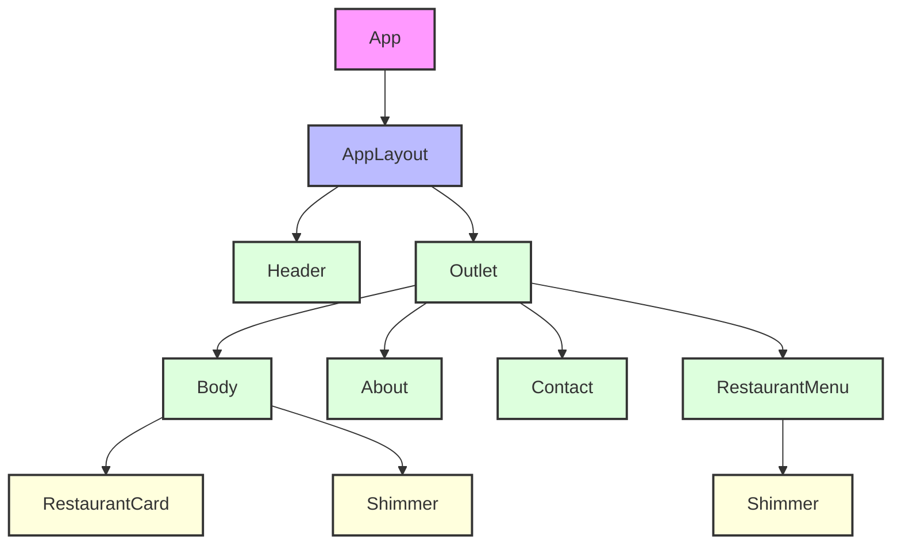
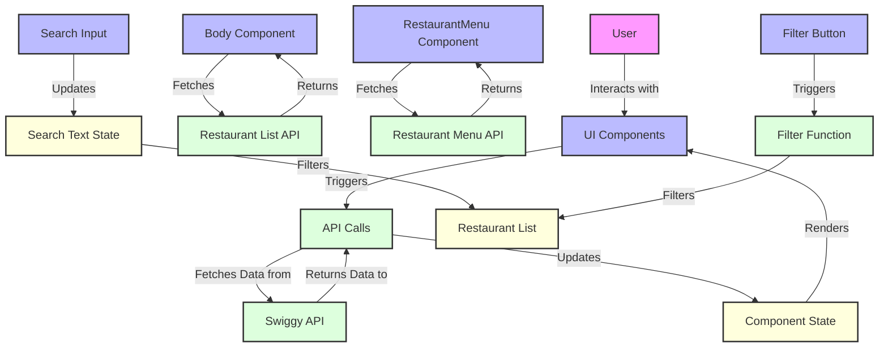
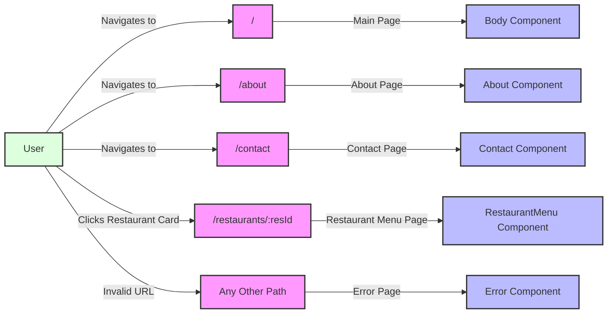
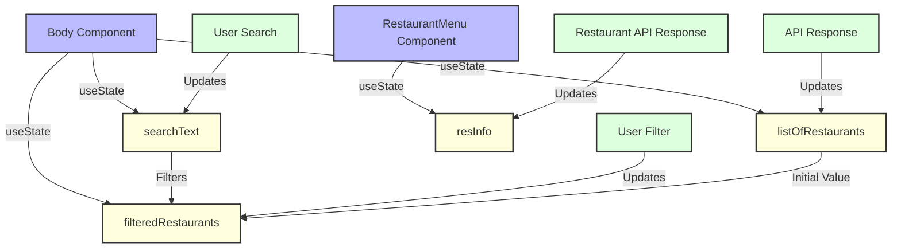

# Namaste React Application Architecture Diagrams

This document contains architecture diagrams for the Namaste React application, a food delivery application similar to Swiggy.

## Table of Contents
1. [Component Hierarchy Diagram](#component-hierarchy-diagram)
2. [Data Flow Diagram](#data-flow-diagram)
3. [Routing Diagram](#routing-diagram)
4. [State Management Diagram](#state-management-diagram)

## Component Hierarchy Diagram

### Component Hierarchy Explanation

The diagram above illustrates the component hierarchy of the Namaste React application:

1. **App**: The root component that initializes the application
2. **AppLayout**: The main layout component that contains the Header and an Outlet for child routes
3. **Header**: The navigation header component that appears on all pages
4. **Outlet**: A placeholder for rendering child routes based on the current URL
5. **Body**: The main page component that displays a list of restaurants
6. **About**: A static page with information about the application
7. **Contact**: A static page with contact information
8. **RestaurantMenu**: A dynamic page that displays the menu for a selected restaurant
9. **RestaurantCard**: A reusable component that displays information about a restaurant
10. **Shimmer**: A loading state component used by both Body and RestaurantMenu

## Data Flow Diagram

### Data Flow Explanation

The diagram above illustrates the data flow within the Namaste React application:

1. **User Interaction**: The user interacts with UI components
2. **API Calls**: These interactions may trigger API calls to the Swiggy API
3. **Data Fetching**: The application fetches data from the Swiggy API
4. **State Updates**: The fetched data is used to update component state
5. **Rendering**: The updated state triggers re-rendering of UI components

Specific data flows include:
- The Body component fetches the restaurant list from the Swiggy API
- The RestaurantMenu component fetches menu data for a specific restaurant
- The search input updates the search text state, which filters the restaurant list
- The filter button triggers a filter function that filters the restaurant list based on ratings

## Routing Diagram

### Routing Explanation

The diagram above illustrates the routing structure of the Namaste React application:

1. **Main Route ("/")**:
   - Renders the Body component
   - Displays a list of restaurants

2. **About Route ("/about")**:
   - Renders the About component
   - Displays information about the application

3. **Contact Route ("/contact")**:
   - Renders the Contact component
   - Displays contact information

4. **Restaurant Menu Route ("/restaurants/:resId")**:
   - Renders the RestaurantMenu component
   - Uses the resId parameter to fetch and display the menu for a specific restaurant

5. **Error Route**:
   - Renders the Error component for any invalid routes
   - Provides a user-friendly error message

## State Management Diagram

### State Management Explanation

The diagram above illustrates the state management within the Namaste React application:

1. **Body Component State**:
   - `listOfRestaurants`: Stores the original list of restaurants fetched from the API
   - `filteredRestaurants`: Stores the filtered list of restaurants based on search or rating filters
   - `searchText`: Stores the current search text entered by the user

2. **RestaurantMenu Component State**:
   - `resInfo`: Stores the restaurant information and menu items fetched from the API

3. **State Updates**:
   - User search updates the searchText state, which filters the restaurant list
   - User filter (e.g., top-rated restaurants) updates the filteredRestaurants state
   - API responses update the listOfRestaurants and resInfo states
   - The listOfRestaurants state provides the initial value for the filteredRestaurants state