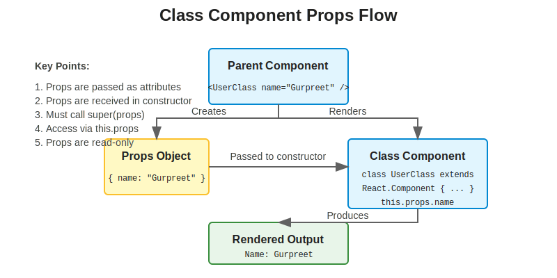
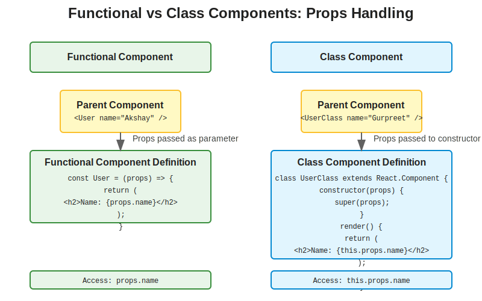

# Understanding Props in Class Components: Fixing the UserClass.js Issue

## Table of Contents
1. [Introduction](#introduction)
2. [The Issue](#the-issue)
3. [What Went Wrong](#what-went-wrong)
4. [How Props Work in React](#how-props-work-in-react)
5. [Comparing Functional and Class Components](#comparing-functional-and-class-components)
6. [The Solution](#the-solution)
7. [Best Practices](#best-practices)
8. [Common Mistakes with Class Component Props](#common-mistakes-with-class-component-props)

## Introduction

In our Namaste React application, we encountered an issue with the `UserClass.js` component not being able to properly access props. This document explains why this happened and how to fix it.

## The Issue

In our application, we have two components that should display user information:
1. `User.js` - A functional component
2. `UserClass.js` - A class component

The functional component works correctly, but the class component shows blank or undefined values for the name, location, and contact properties.

### Current Implementation

**About.js (Parent Component)**
```jsx
import User from "./User";
import UserClass from "./UserClass";

const About = () => {
    return (
        <div style={{ marginTop: "100px", padding: "20px" }}>
            <h1>About</h1>
            <p>This is the About page of our food delivery application.</p>
            <p>We are a team of passionate food lovers who want to bring the best food to your doorstep.</p>
            <User name={"Akshay Saini (functional Component)"} location={"Lucknow"} contact={"@akshay"}/>
            <UserClass/>
        </div>
    );
}

export default About;
```

**UserClass.js (Class Component)**
```jsx
import React from "react";

class UserClass extends React.Component
{
    constructor(props) {
        super(props);
        console.log("Constructor called");
        console.log(props);
        /*this.state = {
            name: "Gurpreet",
            location: "Lucknow",
            contact: "@akshay"
        };*/
    }
    render() {
        return(
        <div className="user-card">
            <h1>User Page</h1>
            <h2>Name: {this.props.name}</h2>
            <h3>Location : {this.props.location}</h3>
            <h4>Contact : {this.props.contact} </h4>
        </div>
    );
    }
}

export default UserClass;
```

## What Went Wrong

The issue is simple but easy to miss: **props are not being passed to the UserClass component in About.js**.

Notice the difference in how the two components are used:
- `<User name={"Akshay Saini (functional Component)"} location={"Lucknow"} contact={"@akshay"}/>`
- `<UserClass/>`

The `User` component receives three props: `name`, `location`, and `contact`.
The `UserClass` component doesn't receive any props.

However, in `UserClass.js`, the component tries to access these props with:
```jsx
<h2>Name: {this.props.name}</h2>
<h3>Location : {this.props.location}</h3>
<h4>Contact : {this.props.contact} </h4>
```

Since no props were passed, `this.props.name`, `this.props.location`, and `this.props.contact` are all `undefined`.

## How Props Work in React



Props (short for "properties") are a way to pass data from parent components to child components in React. They are:

1. **Read-only** - Child components cannot modify the props they receive
2. **Passed down** - Props flow from parent to child, not the other way around
3. **Object-based** - All props are collected into a single object

### Props in Functional Components

In functional components, props are received as a parameter to the function:

```jsx
const User = (props) => {
    return (
        <div>
            <h2>Name: {props.name}</h2>
        </div>
    );
}
```

### Props in Class Components

In class components, props are accessed through `this.props`:

```jsx
class UserClass extends React.Component {
    render() {
        return (
            <div>
                <h2>Name: {this.props.name}</h2>
            </div>
        );
    }
}
```

The key difference is that class components access props through `this.props`, while functional components access props directly through the function parameter.

## Comparing Functional and Class Components



| Functional Components | Class Components |
|----------------------|------------------|
| Props received as function parameter | Props accessed via this.props |
| `const User = (props) => { ... }` | `class UserClass extends React.Component { ... }` |
| Access with `props.name` | Access with `this.props.name` |
| No constructor needed | Constructor needed for initialization |
| No need to call super() | Must call super(props) in constructor |

## The Solution

The solution is simple: we need to pass props to the `UserClass` component in `About.js`:

```jsx
<UserClass name={"Gurpreet (Class Component)"} location={"Lucknow"} contact={"@gurpreet"}/>
```

With this change, the `UserClass` component will receive the props and be able to access them through `this.props.name`, `this.props.location`, and `this.props.contact`.

### Alternative Solution: Default Props

If you want to provide default values for props that might not be passed, you can use default props:

```jsx
class UserClass extends React.Component {
    // Component code...
}

UserClass.defaultProps = {
    name: "Default Name",
    location: "Default Location",
    contact: "Default Contact"
};
```

### Alternative Solution: Using State Instead of Props

If the data doesn't need to be passed from a parent component, you could use state instead:

```jsx
class UserClass extends React.Component {
    constructor(props) {
        super(props);
        this.state = {
            name: "Gurpreet",
            location: "Lucknow",
            contact: "@gurpreet"
        };
    }
    
    render() {
        return(
            <div className="user-card">
                <h1>User Page</h1>
                <h2>Name: {this.state.name}</h2>
                <h3>Location : {this.state.location}</h3>
                <h4>Contact : {this.state.contact} </h4>
            </div>
        );
    }
}
```

## Best Practices

1. **Always pass required props** - Make sure to pass all the props that a component needs
2. **Use PropTypes for validation** - Define the expected props and their types
3. **Provide default props** - Use defaultProps for fallback values
4. **Destructure props** - For cleaner code, especially with many props
5. **Document your components** - Make it clear what props a component expects

## Common Mistakes with Class Component Props

1. **Forgetting to pass props** - As we saw in our issue
2. **Not calling super(props) in constructor** - This prevents this.props from being set
3. **Trying to modify props directly** - Props are read-only
4. **Accessing props incorrectly** - Using props.name instead of this.props.name
5. **Confusing props and state** - Props come from parent, state is internal

By understanding how props work in both functional and class components, you can avoid these common issues and build more robust React applications.