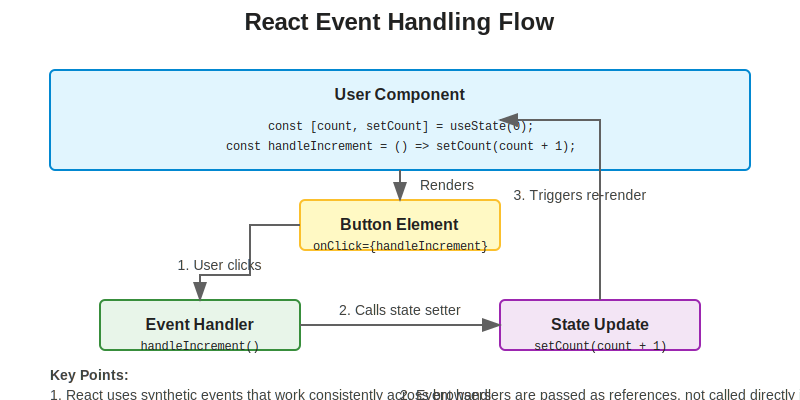
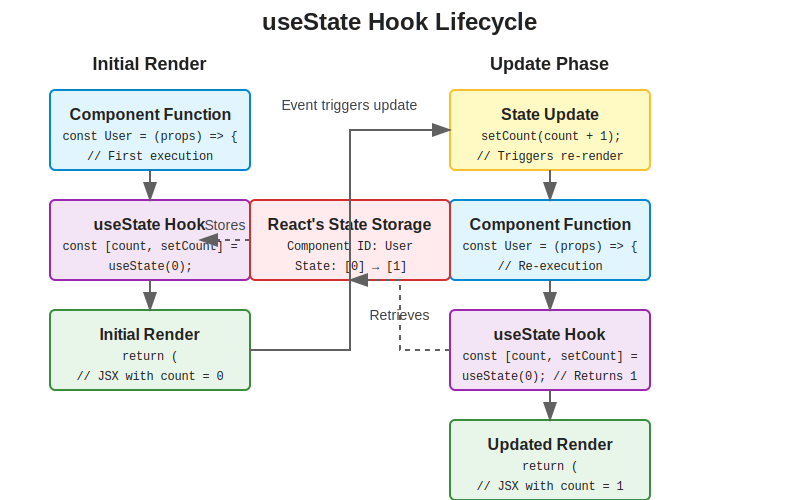
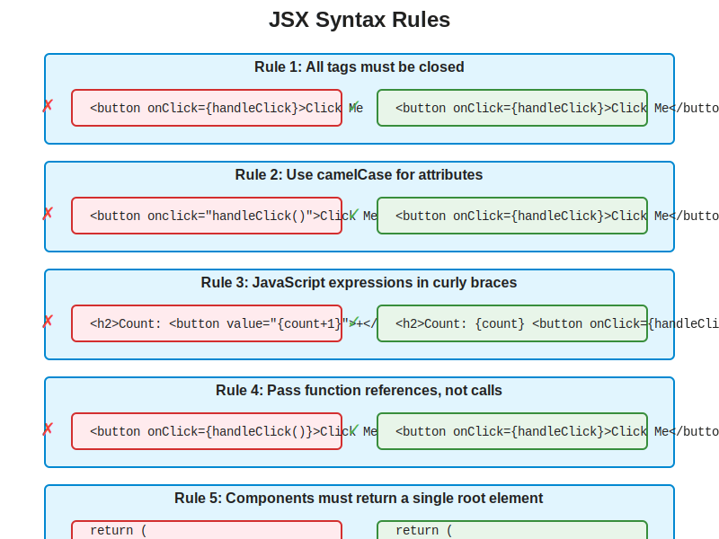

# Understanding the User Component: Issues and Best Practices

## Table of Contents
1. [Introduction](#introduction)
2. [Identifying the Issues](#identifying-the-issues)
3. [Correct Implementation](#correct-implementation)
4. [React Event Handling](#react-event-handling)
5. [The useState Hook](#the-usestate-hook)
6. [JSX Syntax Rules](#jsx-syntax-rules)
7. [Common Mistakes and How to Avoid Them](#common-mistakes-and-how-to-avoid-them)
8. [Debugging React Components](#debugging-react-components)
9. [Best Practices](#best-practices)

## Introduction

The User component in our application is a functional component that displays user information and includes a counter with a button to increment it. However, there are several issues with the current implementation that prevent it from working correctly. This document explains these issues in depth and provides guidance on how to fix them.

## Identifying the Issues

Let's examine the current implementation of the User component:

```jsx
import {useState} from "react";

const User = (props) => {
    const [count,setCount] = useState(0);

    return (
        <div className="user-card">
            <h1>User Page</h1>
            <h2>Count: <button value={"{setcount(count+1)"}</h2>
            <h2>Name: {props.name}</h2>
            <h3>Location : {props.location}</h3>
            <h4>Contact : {props.contact} </h4>
        </div>
    );
}

export default User;
```

There are several issues with this code:

1. **Missing Closing Tag**: The `<button>` element is missing its closing tag, which is required in JSX.

2. **Incorrect Event Handling**: The button uses a `value` attribute instead of an `onClick` event handler. In React, we use event handlers like `onClick` to respond to user interactions.

3. **Incorrect Function Name**: The code attempts to call `setcount` (lowercase) instead of `setCount` (camelCase), which is the correct function name from the useState hook.

4. **Incorrect Syntax**: The curly braces inside the value attribute are incorrectly formatted as a string `"{setcount(count+1)"` instead of being a proper JavaScript expression.

5. **No Button Text**: The button doesn't have any text content, so it would appear empty to users.

## Correct Implementation

Here's the corrected version of the User component:

```jsx
import {useState} from "react";

const User = (props) => {
    const [count, setCount] = useState(0);

    const handleIncrement = () => {
        setCount(count + 1);
    };

    return (
        <div className="user-card">
            <h1>User Page</h1>
            <h2>Count: {count} <button onClick={handleIncrement}>Increment</button></h2>
            <h2>Name: {props.name}</h2>
            <h3>Location: {props.location}</h3>
            <h4>Contact: {props.contact}</h4>
        </div>
    );
}

export default User;
```

Key improvements:
- Added a closing tag for the button element
- Replaced `value` with `onClick` event handler
- Created a separate `handleIncrement` function for better readability
- Correctly used `setCount` with proper camelCase
- Added "Increment" text to the button
- Displayed the current count value

## React Event Handling

React uses a synthetic event system that normalizes browser differences. Here's how event handling works in React:



### Basic Syntax

```jsx
<button onClick={handleClick}>Click Me</button>
```

### Event Handler Functions

There are several ways to define event handlers:

1. **Inline Function**:
```jsx
<button onClick={() => setCount(count + 1)}>Increment</button>
```

2. **Named Function**:
```jsx
const handleClick = () => {
    setCount(count + 1);
};

<button onClick={handleClick}>Increment</button>
```

3. **Bound Method** (in class components):
```jsx
class Counter extends React.Component {
    constructor(props) {
        super(props);
        this.state = { count: 0 };
        this.handleClick = this.handleClick.bind(this);
    }

    handleClick() {
        this.setState({ count: this.state.count + 1 });
    }

    render() {
        return <button onClick={this.handleClick}>Increment</button>;
    }
}
```

### Common Event Types

- `onClick`: Triggered when an element is clicked
- `onChange`: Triggered when the value of an input element changes
- `onSubmit`: Triggered when a form is submitted
- `onMouseOver`: Triggered when the mouse pointer moves over an element
- `onKeyDown`: Triggered when a key is pressed down

### Event Object

React event handlers receive a synthetic event object:

```jsx
const handleClick = (event) => {
    event.preventDefault(); // Prevents default browser behavior
    console.log(event.target); // The DOM element that triggered the event
    setCount(count + 1);
};
```

## The useState Hook

The `useState` hook is a function that lets you add React state to functional components.



### Basic Syntax

```jsx
const [state, setState] = useState(initialValue);
```

- `state`: The current state value
- `setState`: A function to update the state
- `initialValue`: The initial state value

### How useState Works

1. When a component renders for the first time, React calls your component function.
2. When it encounters a call to `useState`, React creates a new state variable with the initial value you provided.
3. When your component renders again, React preserves the state values from the previous render.
4. When you call the state setter function (like `setCount`), React schedules a re-render of the component with the new state value.

### Rules for Using Hooks

1. Only call hooks at the top level of your component, not inside loops, conditions, or nested functions.
2. Only call hooks from React function components or custom hooks, not regular JavaScript functions.

### Multiple State Variables

You can use the `useState` hook multiple times in a single component:

```jsx
const [count, setCount] = useState(0);
const [name, setName] = useState('');
const [isActive, setIsActive] = useState(false);
```

## JSX Syntax Rules

JSX (JavaScript XML) is a syntax extension for JavaScript that looks similar to HTML but has some important differences.



### Key Rules

1. **All tags must be closed**: Either with a closing tag (`<div></div>`) or as a self-closing tag (``)

2. **Components must return a single root element**: You can use fragments (`<>...</>`) to group multiple elements without adding extra nodes to the DOM.

3. **JavaScript expressions in JSX**: Use curly braces `{}` to embed JavaScript expressions in JSX.
   ```jsx
   <h2>Count: {count}</h2>
   ```

4. **Attributes use camelCase**: HTML attributes are written in camelCase in JSX.
   ```jsx
   <div className="container" onClick={handleClick}></div>
   ```

5. **Comments in JSX**: Use JavaScript comment syntax inside curly braces.
   ```jsx
   {/* This is a comment in JSX */}
   ```

6. **Conditional Rendering**: Use JavaScript operators like `&&` or ternary operators for conditional rendering.
   ```jsx
   {isLoggedIn && <UserGreeting />}
   {isLoggedIn ? <UserGreeting /> : <GuestGreeting />}
   ```

## Common Mistakes and How to Avoid Them

### 1. Forgetting to Close Tags

**Incorrect**:
```jsx
<button onClick={handleClick}>Click Me
```

**Correct**:
```jsx
<button onClick={handleClick}>Click Me</button>
```

### 2. Using HTML Attributes Instead of React Props

**Incorrect**:
```jsx
<button onclick="handleClick()">Click Me</button>
```

**Correct**:
```jsx
<button onClick={handleClick}>Click Me</button>
```

### 3. Directly Modifying State

**Incorrect**:
```jsx
count = count + 1; // Don't modify state directly
```

**Correct**:
```jsx
setCount(count + 1); // Use the state setter function
```

### 4. String vs. Expression in JSX

**Incorrect**:
```jsx
<button onClick="{handleClick}">Click Me</button>
```

**Correct**:
```jsx
<button onClick={handleClick}>Click Me</button>
```

### 5. Calling Function Instead of Passing Reference

**Incorrect**:
```jsx
<button onClick={handleClick()}>Click Me</button> // This calls the function immediately
```

**Correct**:
```jsx
<button onClick={handleClick}>Click Me</button> // This passes the function reference
```

## Debugging React Components

When your React components don't work as expected, here are some debugging techniques:

### 1. Console Logging

Add console.log statements to check values:

```jsx
const User = (props) => {
    const [count, setCount] = useState(0);
    console.log("Rendering User component", { count, props });

    const handleIncrement = () => {
        console.log("Before increment:", count);
        setCount(count + 1);
        console.log("After increment (will still show old value):", count);
    };

    // ...
}
```

### 2. React Developer Tools

Use the React Developer Tools browser extension to inspect:
- Component props and state
- Component hierarchy
- Render timing

### 3. Error Boundaries

Wrap components in Error Boundaries to catch and handle errors gracefully:

```jsx
class ErrorBoundary extends React.Component {
    constructor(props) {
        super(props);
        this.state = { hasError: false };
    }

    static getDerivedStateFromError(error) {
        return { hasError: true };
    }

    componentDidCatch(error, errorInfo) {
        console.error("Error caught by boundary:", error, errorInfo);
    }

    render() {
        if (this.state.hasError) {
            return <h1>Something went wrong.</h1>;
        }
        return this.props.children;
    }
}

// Usage
<ErrorBoundary>
    <User name="John" />
</ErrorBoundary>
```

## Best Practices

### 1. Use Descriptive Names

Choose clear, descriptive names for your components, functions, and variables:

```jsx
// Good
const handleIncrement = () => setCount(count + 1);

// Less clear
const handle = () => setCount(count + 1);
```

### 2. Keep Components Small and Focused

Each component should have a single responsibility. Break large components into smaller, reusable ones.

### 3. Use Functional Components with Hooks

Functional components with hooks are generally easier to read and test than class components.

### 4. Extract Complex Logic into Custom Hooks

If you have complex logic that's used in multiple components, extract it into a custom hook:

```jsx
function useCounter(initialValue = 0) {
    const [count, setCount] = useState(initialValue);

    const increment = () => setCount(count + 1);
    const decrement = () => setCount(count - 1);
    const reset = () => setCount(initialValue);

    return { count, increment, decrement, reset };
}

// Usage
const User = (props) => {
    const { count, increment } = useCounter(0);

    return (
        <div className="user-card">
            <h2>Count: {count} <button onClick={increment}>Increment</button></h2>
            {/* ... */}
        </div>
    );
}
```

### 5. Use PropTypes or TypeScript for Type Checking

Add prop validation to catch bugs early:

```jsx
import PropTypes from 'prop-types';

const User = (props) => {
    // Component code...
}

User.propTypes = {
    name: PropTypes.string.isRequired,
    location: PropTypes.string,
    contact: PropTypes.string
};

export default User;
```

### 6. Use Fragments to Avoid Unnecessary Divs

When you need to return multiple elements without adding an extra div to the DOM:

```jsx
return (
    <>
        <h1>Title</h1>
        <p>Paragraph</p>
    </>
);
```

### 7. Use the Functional Form of setState When New State Depends on Previous State

```jsx
// Less reliable if multiple updates happen
setCount(count + 1);

// More reliable
setCount(prevCount => prevCount + 1);
```

By following these best practices and understanding the common issues, you can write more robust and maintainable React components.
