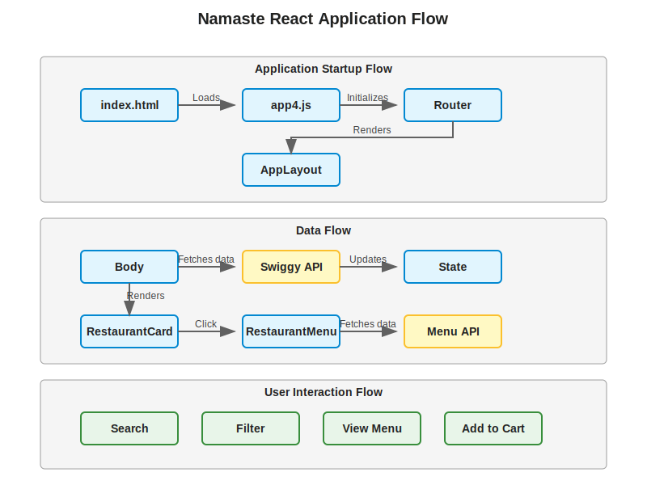
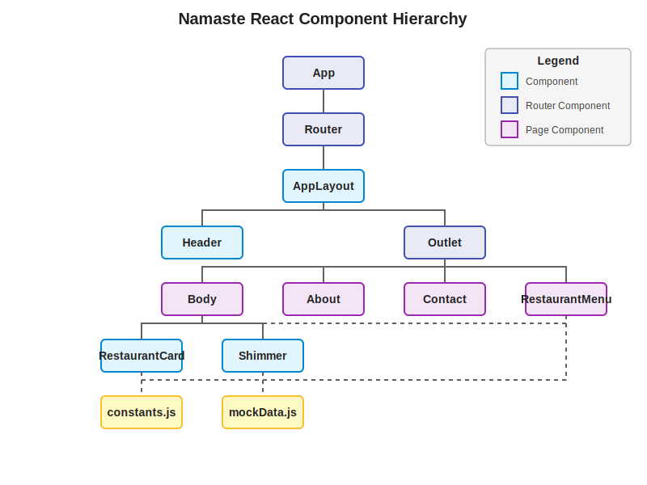

# Namaste React Project
## A Comprehensive React Learning Project

---

## Agenda

1. Project Overview
2. Technology Stack
3. Project Structure
4. Key Components
5. Application Flow
6. Data Flow
7. Routing
8. State Management
9. Key Features
10. Getting Started

---

## Project Overview

Namaste React is a comprehensive React learning project that demonstrates:

- Different approaches to creating and rendering content
- React component architecture
- React hooks and state management
- Routing with React Router
- API integration
- Modern JavaScript practices

The application is a food delivery platform inspired by Swiggy (an Indian food delivery service).

---

## Technology Stack

### Frontend
- **React**: A JavaScript library for building user interfaces
- **React Router**: For handling navigation and routing
- **CSS**: For styling components
- **Parcel**: Web application bundler

### APIs
- The application uses Swiggy's public API for fetching restaurant and menu data

---

## Project Structure

```
namaste-react/
├── src/                  # Source code
│   ├── components/       # React components
│   └── utils/            # Utility functions and constants
├── app.js                # Example React code
├── index.css             # Global CSS styles
├── index.html            # HTML entry point
└── package.json          # Project dependencies and scripts
```

---

## Key Components

### AppLayout
The main layout component that includes the Header and the Outlet for route-specific content.

### Header
The navigation header that includes the logo, location, search bar, and user options.

### Body
The main content area that displays the list of restaurants.

### RestaurantCard
A card component that displays restaurant information.

### RestaurantMenu
A component that displays the menu for a specific restaurant.

---

## Application Flow



---

## Component Hierarchy



---

## Data Flow

1. When the application loads, the `Body` component fetches restaurant data from the Swiggy API
2. The data is stored in the component's state using React's `useState` hook
3. The data is passed down to child components (like `RestaurantCard`) as props
4. When a user clicks on a restaurant card, they are navigated to the restaurant menu page
5. The `RestaurantMenu` component fetches the specific restaurant's menu data using the restaurant ID
6. The menu data is displayed to the user

---

## Routing Structure

The application uses React Router for navigation with the following routes:

- `/` - Home page (Body component)
- `/about` - About page
- `/contact` - Contact page
- `/restaurant/:resId` - Restaurant menu page

---

## State Management

The application uses React's built-in state management with `useState` and `useEffect` hooks:

- `useState` is used to manage component-specific state like restaurant list, search text, etc.
- `useEffect` is used for side effects like fetching data from APIs

---

## Key Features

- Browse restaurants
- View restaurant details and menus
- Search for restaurants
- Filter restaurants based on various criteria
- View restaurant menus and add items to cart

---

## Getting Started

1. Clone the repository
2. Install dependencies with `npm install`
3. Start the development server with `npm start`
4. Open your browser and navigate to `http://localhost:1234`

---

## Thank You!

For more detailed information, please refer to the documentation in the `docs` directory.