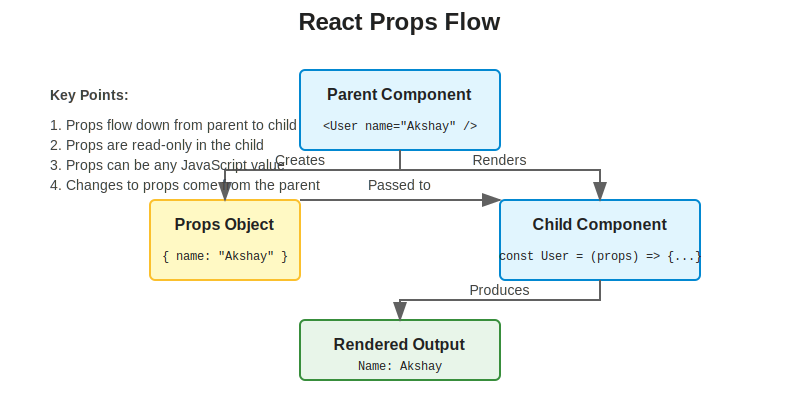
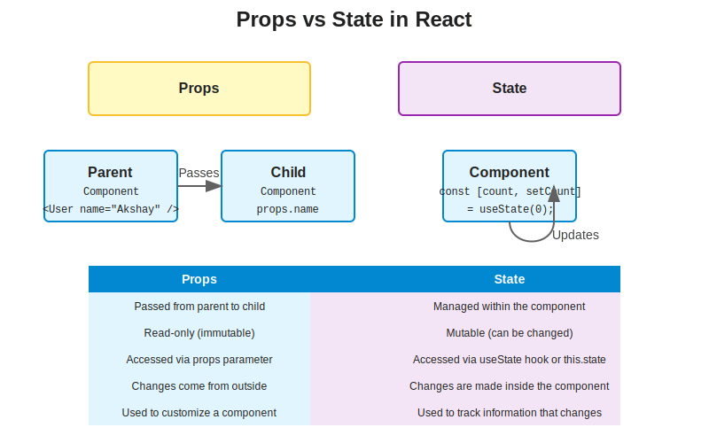

# Understanding Props in React

## Table of Contents
1. [Introduction to Props](#introduction-to-props)
2. [Passing Props to Components](#passing-props-to-components)
3. [Accessing Props in Functional Components](#accessing-props-in-functional-components)
4. [Accessing Props in Class Components](#accessing-props-in-class-components)
5. [Props Destructuring Techniques](#props-destructuring-techniques)
6. [Props Validation with PropTypes](#props-validation-with-proptypes)
7. [Default Props](#default-props)
8. [Props vs State](#props-vs-state)
9. [Props Drilling and Solutions](#props-drilling-and-solutions)
10. [Best Practices for Working with Props](#best-practices-for-working-with-props)
11. [Common Interview Questions about Props](#common-interview-questions-about-props)

## Introduction to Props

Props (short for "properties") are a core concept in React that enable the flow of data from parent components to child components. They are read-only and help make your components reusable and dynamic.

### Key Characteristics of Props

- **Unidirectional Data Flow**: Props flow down from parent to child components, never up.
- **Immutable**: Child components cannot modify the props they receive.
- **Object-Based**: All props are passed as a single object, even when you specify them individually.
- **Can Contain Any Data Type**: Props can be strings, numbers, booleans, arrays, objects, functions, and even other React components.



## Passing Props to Components

Props are passed to components as attributes in JSX, similar to HTML attributes. Let's look at how props are passed in our About component:

```jsx
// From About.js
<User name={"Akshay Saini (functional Component)"} location={"Lucknow"} contact={"@akshay"}/>
```

In this example, the About component is passing three props to the User component:
- `name` with the value "Akshay Saini (functional Component)"
- `location` with the value "Lucknow"
- `contact` with the value "@akshay"

### Different Ways to Pass Props

1. **String Literals**:
   ```jsx
   <User name="Akshay Saini" />
   ```

2. **JavaScript Expressions** (using curly braces):
   ```jsx
   <User name={"Akshay Saini"} />
   <User age={30} />
   <User isActive={true} />
   ```

3. **Spreading an Object**:
   ```jsx
   const userProps = {
     name: "Akshay Saini",
     location: "Lucknow",
     contact: "@akshay"
   };
   <User {...userProps} />
   ```

4. **Children Props**:
   ```jsx
   <User>
     <h1>This content is passed as children prop</h1>
   </User>
   ```

## Accessing Props in Functional Components

In functional components, props are received as a parameter to the function. Let's look at how props are accessed in our User component:

```jsx
// From User.js
const User = (props) => {
    return (
        <div className="user-card">
            <h1>User Page</h1>
            <h2>Name: {props.name}</h2>
            <h3>Location : {props.location}</h3>
            <h4>Contact : {props.contact} </h4>
        </div>
    );
}
```

In this example, the User component receives the props object and accesses individual properties using dot notation: `props.name`, `props.location`, and `props.contact`.

## Accessing Props in Class Components

In class components, props are accessed through `this.props`. Here's how our UserClass component could be modified to use props:

```jsx
// Modified version of UserClass.js
import React from "react";

class UserClass extends React.Component {
    render() {
        return(
        <div className="user-card">
            <h1>User Page</h1>
            <h2>Name: {this.props.name}</h2>
            <h3>Location : {this.props.location}</h3>
            <h4>Contact : {this.props.contact} </h4>
        </div>
        );
    }
}

export default UserClass;
```

And then in About.js, we would pass props to UserClass just like we do for User:

```jsx
// Modified version of About.js
<UserClass name={"Gurpreet (Class Component)"} location={"Lucknow"} contact={"@gurpreet"}/>
```

### Constructor and Props in Class Components

In class components, if you need to access props in the constructor, you must pass props to the super() call:

```jsx
class UserClass extends React.Component {
    constructor(props) {
        super(props); // This is required to access this.props in the constructor
        this.state = {
            // Initialize state using props if needed
            userInfo: props.initialUserInfo
        };
    }
    
    render() {
        // Rest of the component
    }
}
```

## Props Destructuring Techniques

Destructuring is a JavaScript feature that allows you to extract values from objects or arrays into distinct variables. It can make your code cleaner and more readable when working with props.

### Destructuring in Functional Components

```jsx
// Destructuring in the parameter
const User = ({ name, location, contact }) => {
    return (
        <div className="user-card">
            <h1>User Page</h1>
            <h2>Name: {name}</h2>
            <h3>Location : {location}</h3>
            <h4>Contact : {contact} </h4>
        </div>
    );
}

// Alternatively, destructuring inside the function
const User = (props) => {
    const { name, location, contact } = props;
    return (
        <div className="user-card">
            <h1>User Page</h1>
            <h2>Name: {name}</h2>
            <h3>Location : {location}</h3>
            <h4>Contact : {contact} </h4>
        </div>
    );
}
```

### Destructuring in Class Components

```jsx
class UserClass extends React.Component {
    render() {
        const { name, location, contact } = this.props;
        return(
        <div className="user-card">
            <h1>User Page</h1>
            <h2>Name: {name}</h2>
            <h3>Location : {location}</h3>
            <h4>Contact : {contact} </h4>
        </div>
        );
    }
}
```

### Nested Destructuring

For more complex props objects, you can use nested destructuring:

```jsx
const UserProfile = ({ user: { name, location, contact, social: { twitter, github } } }) => {
    return (
        <div>
            <h2>{name}</h2>
            <p>{location}</p>
            <p>{contact}</p>
            <p>Twitter: {twitter}</p>
            <p>GitHub: {github}</p>
        </div>
    );
}
```

## Props Validation with PropTypes

PropTypes is a library that helps you validate the props that are passed to your components. It's especially useful for larger projects and when working in teams.

First, you need to install the prop-types package:
```bash
npm install prop-types
```

Then, you can use it in your components:

```jsx
import PropTypes from 'prop-types';

const User = ({ name, location, contact }) => {
    return (
        <div className="user-card">
            <h1>User Page</h1>
            <h2>Name: {name}</h2>
            <h3>Location : {location}</h3>
            <h4>Contact : {contact} </h4>
        </div>
    );
}

User.propTypes = {
    name: PropTypes.string.isRequired,
    location: PropTypes.string,
    contact: PropTypes.string
};

export default User;
```

In this example:
- `name` is expected to be a string and is required
- `location` and `contact` are expected to be strings but are not required

### Available PropTypes Validators

- `PropTypes.array`
- `PropTypes.bool`
- `PropTypes.func`
- `PropTypes.number`
- `PropTypes.object`
- `PropTypes.string`
- `PropTypes.symbol`
- `PropTypes.node` (anything that can be rendered)
- `PropTypes.element` (a React element)
- `PropTypes.instanceOf(Class)`
- `PropTypes.oneOf(['News', 'Photos'])` (one of a specific set of values)
- `PropTypes.oneOfType([PropTypes.string, PropTypes.number])` (one of multiple types)
- `PropTypes.arrayOf(PropTypes.number)` (an array of a specific type)
- `PropTypes.objectOf(PropTypes.number)` (an object with values of a specific type)
- `PropTypes.shape({ name: PropTypes.string, age: PropTypes.number })` (an object with a specific shape)
- `PropTypes.exact({ name: PropTypes.string, age: PropTypes.number })` (an object with exact shape)

## Default Props

Default props allow you to specify default values for props in case they are not provided by the parent component.

### Default Props in Functional Components

```jsx
const User = ({ name, location, contact }) => {
    return (
        <div className="user-card">
            <h1>User Page</h1>
            <h2>Name: {name}</h2>
            <h3>Location : {location}</h3>
            <h4>Contact : {contact} </h4>
        </div>
    );
}

User.defaultProps = {
    name: 'Guest User',
    location: 'Unknown',
    contact: 'N/A'
};

export default User;
```

### Default Props in Class Components

```jsx
class UserClass extends React.Component {
    render() {
        return(
        <div className="user-card">
            <h1>User Page</h1>
            <h2>Name: {this.props.name}</h2>
            <h3>Location : {this.props.location}</h3>
            <h4>Contact : {this.props.contact} </h4>
        </div>
        );
    }
}

UserClass.defaultProps = {
    name: 'Guest User',
    location: 'Unknown',
    contact: 'N/A'
};

export default UserClass;
```

### Default Values with Destructuring

You can also specify default values directly in the destructuring:

```jsx
const User = ({ name = 'Guest User', location = 'Unknown', contact = 'N/A' }) => {
    return (
        <div className="user-card">
            <h1>User Page</h1>
            <h2>Name: {name}</h2>
            <h3>Location : {location}</h3>
            <h4>Contact : {contact} </h4>
        </div>
    );
}
```

## Props vs State

Understanding the difference between props and state is crucial for working effectively with React.

| Props | State |
|-------|-------|
| Passed from parent to child | Managed within the component |
| Read-only (immutable) | Mutable (can be changed) |
| Can be accessed in both functional and class components | In functional components, accessed via useState hook; in class components, via this.state |
| Changes to props come from outside the component | Changes to state are made inside the component |
| Used to customize a component when it's created | Used to track information that changes over time |



## Props Drilling and Solutions

Props drilling occurs when props need to be passed through multiple levels of components to reach a deeply nested component that actually needs them.

### Example of Props Drilling

```jsx
// App.js
const App = () => {
    const user = { name: "Akshay", location: "Lucknow" };
    return <ParentComponent user={user} />;
}

// ParentComponent.js
const ParentComponent = ({ user }) => {
    return <MiddleComponent user={user} />;
}

// MiddleComponent.js
const MiddleComponent = ({ user }) => {
    return <ChildComponent user={user} />;
}

// ChildComponent.js
const ChildComponent = ({ user }) => {
    return (
        <div>
            <h2>{user.name}</h2>
            <p>{user.location}</p>
        </div>
    );
}
```

In this example, `user` is passed from App to ParentComponent to MiddleComponent to ChildComponent, even though only ChildComponent actually uses it.

### Solutions to Props Drilling

1. **Context API**: React's Context API allows you to share values between components without explicitly passing props through every level.

```jsx
// Create a context
const UserContext = React.createContext();

// Provider in a parent component
const App = () => {
    const user = { name: "Akshay", location: "Lucknow" };
    return (
        <UserContext.Provider value={user}>
            <ParentComponent />
        </UserContext.Provider>
    );
}

// Consumer in a deeply nested component
const ChildComponent = () => {
    const user = React.useContext(UserContext);
    return (
        <div>
            <h2>{user.name}</h2>
            <p>{user.location}</p>
        </div>
    );
}
```

2. **Component Composition**: Instead of passing props down, you can compose components to avoid the need for props drilling.

3. **State Management Libraries**: For more complex applications, libraries like Redux, MobX, or Recoil can help manage global state.

## Best Practices for Working with Props

1. **Keep Components Pure**: Treat props as read-only and don't modify them.

2. **Use Prop Destructuring**: Destructure props for cleaner code.

3. **Validate Props with PropTypes**: Use PropTypes to catch bugs early.

4. **Provide Default Props**: Use defaultProps to handle cases where props aren't provided.

5. **Use Meaningful Prop Names**: Choose clear, descriptive names for your props.

6. **Avoid Excessive Props**: If a component needs too many props, consider breaking it down into smaller components.

7. **Use Spread Operator Judiciously**: While `{...props}` can be convenient, it can make it harder to track which props a component is using.

8. **Document Your Components**: Add comments or use tools like Storybook to document the props your components accept.

## Common Interview Questions about Props

1. **What are props in React?**
   - Props are inputs to React components that allow you to pass data from parent to child components. They are read-only and help make components reusable.

2. **How do you pass props to a component?**
   - Props are passed as attributes in JSX, similar to HTML attributes. For example: `<User name="Akshay" />`.

3. **What is the difference between props and state?**
   - Props are passed from parent to child and are immutable within the component. State is managed within the component and can be changed.

4. **How do you access props in a functional component?**
   - Props are received as a parameter to the function and can be accessed directly or through destructuring.

5. **How do you access props in a class component?**
   - Props are accessed through `this.props` in class components.

6. **What is prop drilling and how can you avoid it?**
   - Prop drilling is passing props through multiple levels of components. It can be avoided using Context API, component composition, or state management libraries.

7. **How do you validate props in React?**
   - You can use the PropTypes library to validate props, specifying the expected type and whether they are required.

8. **Can you modify props in a component?**
   - No, props should be treated as read-only. If you need to modify data, you should use state instead.

9. **What are default props and how do you set them?**
   - Default props provide fallback values for props that aren't specified. They can be set using the `defaultProps` property or through destructuring defaults.

10. **How do you pass a function as a prop?**
    - Functions can be passed as props just like any other value: `<Button onClick={handleClick} />`.

11. **What is the children prop in React?**
    - The children prop is a special prop that contains the content between the opening and closing tags of a component: `<User>This is the children prop</User>`.

12. **How do you conditionally pass props?**
    - You can use conditional operators to conditionally pass props: `<User name={isLoggedIn ? username : 'Guest'} />`.

---

This guide provides a comprehensive understanding of props in React, from basic concepts to advanced techniques. By mastering props, you'll be able to create more reusable, flexible, and maintainable React components.