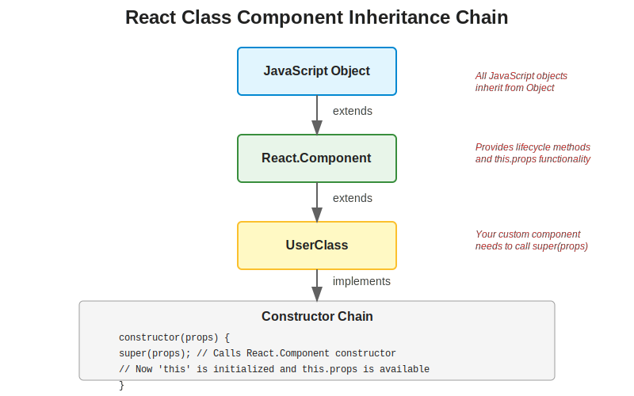
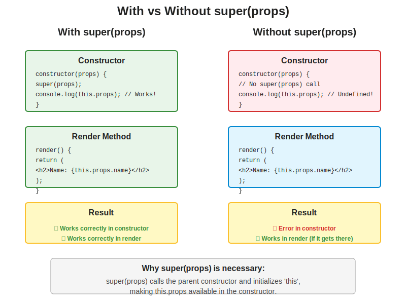
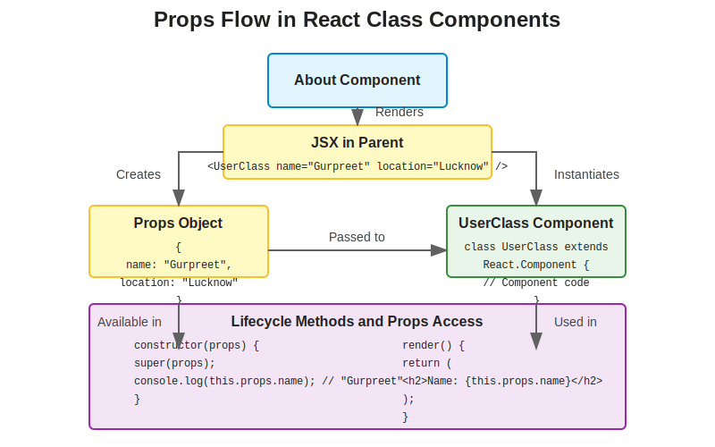

# Understanding super(props) in React Class Components

## Table of Contents
1. [Introduction](#introduction)
2. [What is super(props)?](#what-is-superpropss)
3. [Why is super(props) Necessary?](#why-is-superprops-necessary)
4. [The Inheritance Chain in React Components](#the-inheritance-chain-in-react-components)
5. [What Happens With and Without super(props)](#what-happens-with-and-without-superprops)
6. [Props Flow in Class Components](#props-flow-in-class-components)
7. [Best Practices](#best-practices)
8. [Common Interview Questions](#common-interview-questions)

## Introduction

In our Namaste React application, we have a class component called `UserClass` that extends `React.Component`. In the constructor of this component, we call `super(props)`. This document explains in depth why we need to call `super(props)` in React class components, what happens if we don't, and best practices around its usage.

## What is super(props)?

In JavaScript, `super` refers to the parent class constructor. In React class components, when we extend `React.Component`, we need to call `super()` in the constructor before using `this`.

```jsx
class UserClass extends React.Component {
    constructor(props) {
        super(props); // This calls the constructor of React.Component
        // Now we can use 'this'
    }
    // ...
}
```

The `props` parameter is passed to `super()` to ensure that the parent constructor initializes `this.props` correctly.

## Why is super(props) Necessary?

There are several reasons why calling `super(props)` is necessary in React class components:

1. **JavaScript Requirement**: In JavaScript, if you have a constructor in a subclass, you must call the parent constructor using `super()` before using `this`. This is a language requirement, not specific to React.

2. **Props Initialization**: When you call `super(props)`, React sets up `this.props` in the constructor. Without it, `this.props` would be undefined in the constructor.

3. **React's Internal Workings**: React uses the props passed to the constructor to set up the component instance. Without passing props to `super()`, React wouldn't know what props to use.

Let's look at our `UserClass` component:

```jsx
class UserClass extends React.Component {
    constructor(props) {
        super(props);
        console.log("Constructor called");
        console.log(props); // This works because props is a parameter
        console.log(this.props); // This works because super(props) was called
    }
    render() {
        return(
            <div className="user-card">
                <h1>User Page</h1>
                <h2>Name: {this.props.name}</h2>
                <h3>Location: {this.props.location}</h3>
                <h4>Contact: {this.props.contact}</h4>
            </div>
        );
    }
}
```

In this component, we call `super(props)` in the constructor, which allows us to access `this.props` both in the constructor and in the render method.

## The Inheritance Chain in React Components

To understand why `super(props)` is necessary, it helps to understand the inheritance chain in React components.



1. **JavaScript Object**: At the top of the chain is the JavaScript `Object`, which is the base of all objects in JavaScript.

2. **React.Component**: This is the base class for all React class components. It provides lifecycle methods, state management, and props handling.

3. **UserClass**: This is our custom component that extends `React.Component`. It inherits all the functionality from `React.Component`.

When we create a class component, we're creating a subclass of `React.Component`. The constructor chain works as follows:

1. Our component's constructor is called with props
2. We call `super(props)` to invoke the parent constructor
3. The parent constructor initializes the component instance
4. Our constructor continues execution with `this` properly initialized

## What Happens With and Without super(props)

Let's compare what happens when we call `super(props)` versus when we don't:



### With super(props)

```jsx
constructor(props) {
    super(props);
    console.log(this.props); // Works! this.props is defined
}
```

When we call `super(props)`:
- The parent constructor is called with props
- `this` is properly initialized
- `this.props` is set up and available in the constructor
- Everything works as expected in the render method

### Without super(props)

```jsx
constructor(props) {
    super(); // No props passed
    console.log(this.props); // Undefined! this.props is not set up
}
```

When we call `super()` without props:
- The parent constructor is called without props
- `this` is initialized, but `this.props` is not set up
- `this.props` is undefined in the constructor
- `this.props` will still work in render and other methods (React sets it up later)

### With no super() call

```jsx
constructor(props) {
    // No super() call
    console.log(this.props); // Error! 'this' is not initialized
}
```

When we don't call `super()` at all:
- The parent constructor is not called
- `this` is not initialized
- Trying to use `this` will throw a ReferenceError
- The component will fail to render

## Props Flow in Class Components

To fully understand how props work in class components, let's look at the flow of props from parent to child:



1. **Parent Component**: The parent component (e.g., `About`) renders the child component with props:
   ```jsx
   <UserClass name="Gurpreet" location="Lucknow" contact="@gurpreet" />
   ```

2. **Props Object**: React creates a props object with these values:
   ```js
   {
     name: "Gurpreet",
     location: "Lucknow",
     contact: "@gurpreet"
   }
   ```

3. **Child Component Constructor**: The props object is passed to the child component's constructor:
   ```jsx
   constructor(props) {
     super(props);
     // Now this.props is available
   }
   ```

4. **Render Method**: The props can be accessed in the render method:
   ```jsx
   render() {
     return (
       <div>
         <h2>Name: {this.props.name}</h2>
         <h3>Location: {this.props.location}</h3>
         <h4>Contact: {this.props.contact}</h4>
       </div>
     );
   }
   ```

## Best Practices

Here are some best practices for using `super(props)` in React class components:

1. **Always call super(props)**: Even if you don't use `this.props` in the constructor, it's a good practice to always call `super(props)` to ensure consistent behavior.

2. **Call super(props) first**: Always call `super(props)` as the first statement in your constructor to ensure `this` is properly initialized before you do anything else.

3. **Use constructor only when necessary**: If you don't need to initialize state or bind methods, you don't need a constructor at all. React will automatically call the parent constructor with props.

4. **Consider using functional components**: With the introduction of hooks in React 16.8, functional components can now use state and other React features. Consider using functional components instead of class components for new code.

## Common Interview Questions

Here are some common interview questions about `super(props)` in React class components:

### 1. Why do we need to call super(props) in React class components?

**Answer**: We need to call `super(props)` in React class components for two main reasons:
1. In JavaScript, when a subclass has a constructor, it must call the parent constructor using `super()` before using `this`.
2. Passing `props` to `super()` ensures that `this.props` is properly initialized in the constructor, allowing us to access props in the constructor.

### 2. What happens if we don't call super(props) in a React class component?

**Answer**: If you don't call `super(props)`:
- If you don't call `super()` at all, you'll get a ReferenceError when trying to use `this` because it's not initialized.
- If you call `super()` without props, `this.props` will be undefined in the constructor, but it will work in other methods like render (React sets it up later).

### 3. Can we use this.props in the constructor without calling super(props)?

**Answer**: No, if you call `super()` without passing props, `this.props` will be undefined in the constructor. You need to call `super(props)` to access `this.props` in the constructor.

### 4. Is super(props) necessary if we don't use this.props in the constructor?

**Answer**: Technically, you can call `super()` without props if you don't use `this.props` in the constructor. However, it's considered a best practice to always call `super(props)` for consistency and to avoid potential issues if you later decide to use `this.props` in the constructor.

### 5. What's the difference between props and this.props in the constructor?

**Answer**: In the constructor, `props` is the parameter passed to the constructor, while `this.props` is the property set up by React on the component instance. If you call `super(props)`, they will contain the same values. If you don't call `super(props)`, `this.props` will be undefined in the constructor, but `props` will still be available as a parameter.

### 6. Do functional components need super(props)?

**Answer**: No, functional components don't need `super(props)` because they don't use constructors or the `this` keyword. Props are simply parameters to the function.

### 7. Why does React set up this.props even if we don't call super(props)?

**Answer**: React sets up `this.props` after the constructor has finished, regardless of whether you called `super(props)`. This is why `this.props` works in methods like `render()` even if you didn't call `super(props)`. However, it's still recommended to call `super(props)` to ensure consistent behavior.

### 8. Can we modify props in a React component?

**Answer**: No, props should be treated as read-only. React components should be pure with respect to their props, meaning they should not modify their props. If you need to modify data, you should use state instead.

### 9. What's the purpose of the constructor in a React class component?

**Answer**: The constructor in a React class component is used for:
1. Initializing local state by assigning an object to `this.state`
2. Binding event handler methods to the instance
3. Setting up any class-level properties

If you don't need to do any of these things, you don't need to implement a constructor.

### 10. What's the recommended way to handle props in modern React applications?

**Answer**: In modern React applications, it's recommended to use functional components with hooks instead of class components. With functional components, props are simply parameters to the function, and you don't need to worry about `super(props)` or constructors.

```jsx
const UserFunction = (props) => {
  // No constructor, no super(props)
  return (
    <div>
      <h2>Name: {props.name}</h2>
      <h3>Location: {props.location}</h3>
      <h4>Contact: {props.contact}</h4>
    </div>
  );
};
```

With hooks, you can also use state and other React features in functional components:

```jsx
const UserFunction = (props) => {
  const [count, setCount] = useState(0);
  
  return (
    <div>
      <h2>Name: {props.name}</h2>
      <h3>Location: {props.location}</h3>
      <h4>Contact: {props.contact}</h4>
      <p>Count: {count}</p>
      <button onClick={() => setCount(count + 1)}>Increment</button>
    </div>
  );
};
```